# Voyage Into the Unknown
### Advith Chegu (ac1771) & Naveenan Yogeswaran (nry7)

**Question 1**: Why does re-planning only occur when blocks are discovered on the current path? Why not whenever knowledge of the environment is updated?

**Answer**: Because A* finds the optimal path, it shouldn't matter if there are any obstacles that are not in the path as we will continue on our current path as we're currently on the most optimal path as determined by our A*. It would be a waste of time to re-plan every time there's an update in the environment because we're already on an optimal path to the goal node and we're still able to continue on that path without having to replan.

**Question 2**: Will the agent ever get stuck in a solvable maze? Why or why not?

**Answer**: Because we use the A* algorithm and backtracking, we will never get stuck in a solvable maze. This is because A* will explore every node that’s reachable until there are no more nodes to explore, in which case the maze has to be unsolvable. The agent *does* get stuck in a maze when its neighbors are arranged in a way that it is blocked from progressing even if it back tracks *(an unsolvable maze)*. Let's take an example of one:

```
[0, 0, 1, 1, 1]
[1, 1, 1, 1, 1]
[0, 0, 0, 0, 0]
[1, 1, 0, 0, 0]
[1, 0, 1, 1, 0]
```

We clearly see that the above maze is not solvable because once the agent takes a step to the right, there is no additional step to take other than back to the start and once it back tracks there is no way to move forward. Now lets see an example of a solvable maze:

```
[0, 1, 0, 0, 0]
[0, 0, 0, 0, 0]
[0, 0, 1, 0, 0]
[1, 0, 1, 0, 0]
[0, 0, 0, 0, 0]
```

Once we run repeated A* we find the following path:

```
[2, 1, 0, 0, 0]
[2, 2, 0, 0, 0]
[0, 2, 1, 0, 0]
[1, 2, 1, 0, 0]
[0, 2, 2, 2, 2]

```

Now although the agent had to recalculate **2** times due to obstacles in its original path, our agent is always going to move backwards and find a different path each time. We do this by first checking if the current path is blocked and returning the section before the blocked node.

```python
    # check if path is blocked
    if complete_grid.gridworld[curr[0]][curr[1]] == 1:
        # update our knowledge of blocked nodes
        discovered_grid.update_grid_obstacle(curr, 1)
        return node.parent_block
```

Then we go back and create a new path (avoiding the blocks we discovered) using repeated A*.

```python
    # get the last unblocked block
    last_block = (0,0)
    last_unblock_node = None
    if last_node:
        last_block = last_node.curr_block
        last_unblock_node = last_node.parent_block
    # check if the path made it to the goal node
    if last_block == (dim-1, dim-1):
        break
    # create a new path from the last unblocked node
    new_path, cells_processed = path_planner(last_block, last_unblock_node, discovered_grid, dim, heuristic_pointer)
    total_cells_processed += cells_processed
```

By using backtracking in the case of a blockage in the path, we can avoid getting stuck in a solvable maze as we can always move back node by node and check for new paths using A*. A* will then explore any node that is reachable until it either reaches the goal node or it runs out of reachable nodes, in which case the maze is unsolvable.

**Question 3**: Once the agent reaches the target, consider re-solving the now discovered gridworld for the shortest path (eliminating any backtracking that may have occurred). Will this be an optimal path in the complete gridworld? Argue for, or give a counter example.

**Answer**: While the A* algorithm will always give us the shortest path; repeated A* might not give us the most optimal path and this could lead us to not having the shortest path after re-solving the now discovered gridworld. For example let us take the following maze:

```
[0,0,0,0,0,0]
[0,1,1,1,1,0]
[0,1,1,0,0,0]
[0,1,0,0,1,0]
[0,1,0,1,1,0]
[0,0,0,1,1,0]
```

Depending on how we setup our queue and heuristic functions, our agent has two options:
 1. If the agent takes a step to the right first then it is on its way to find the shortest path as it continues right. In this case our discovered gridworld, once the agent moves through it, will contain the shortest path and A* will follow this path to the finish node when re-solving the now discovered gridworld.
 2. If the agent takes a step down first (which likely has the same priority as taking a step to the right depending on heuristic), then it will have to follow the longer path as it continues downward due to smaller priorities (f(x)). In this case our discovered gridworld will not contain the shortest path of the complete gridworld and therefore will not be able to traverse it once we re run A* on the discovered world.

Therefore as you can see, if we were to re-solve our discovered gridworld once a path was found; though it is certainly possible that the shortest (most optimal) path is found it is by no means a guarantee.

**Question 4**: A gridworld is solvable if it has a clear path from start to goal nodes. How does solvability depend on $p$? Given $dim = 101$, how does solvability depend on $p$? For a range of $p$ values, estimate the probability that a maze will be solvable by generating multiple environments and checking them for solvability. Plot density vs solvability, and try to identify as accurately as you can the threshold $p_0$ where for $p < p_0$, most mazes are solvable, but $p > p_0$, most mazes are not solvable. Is A* the best search algorithm to use here, to test for solvability? Note for this problem you may assume that the entire gridworld is known, and hence only needs to be searched once each.

**Answer**: We can assume that once density of blocks increases, there will be a steep decline in solvability and the number of paths to the finish node will be severely reduced. To test our hypothesis we calculated solvability after running 100 trials of the algorithm at p being each tenth of a decimal between 0 to 0.9. We tested with a 101 x 101 dim array. After running our tests, we got this resulting plot.

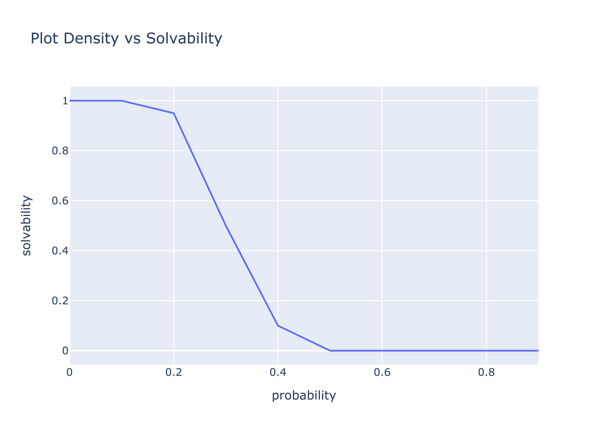

As we can see, there's a clear and steep decline of the solvability of the gridworld once we increase $p_0$ to $0.4$. Therefore our hypothesis has been tested and true; solvability does indeed fall steeply once you reach a threshold probability of $p_0=0.4$ when solvability decreases to $0.04$ according to our testing.

We do believe that A* is the best search algorithm to test for solvability here as it is guaranteed to find a path in any solvable gridworld due to it's path planning and heuristics methodologies. Therefore if A* did not succeed, it means that the gridworld was not a solvable one which is what we are trying to measure.

**Question 5**: Among environments that are solvable, is one heuristic uniformly better than the other for running A*? How can they be compared? Plot the relevant data and justify your conclusions. Again, you may take each gridworld as known, and thus only search once.

**Answer**: 
We can compare these heuristics by having them run with A* on identical grids and seeing how fast they perform by observing the runtime. A heursitic that is able to find an optimal path for a grid in a faster runtime is considered better than a heuristic which found an optimal path in a slower runtime. 

Acording to our findings the manhattan distance is uniformly better than the others for running A*. To find the best heuristic we first fixed $p=0.1$ and $dimension=500$ and we ran the following loop $100$ times recording the time each loop and each heuristic. To be fair to all three heuristics we made sure to use the same grid for each one every time we ran the loop.

```python
# create the gridworld
    complete_grid = Gridworld(dim, prob, False)
    final_path = None

    # times: chebyshev, manhattan, euclidian
    times = []

    for i,h in enumerate([chebyshev, manhattan, euclidian]):
        starting_time = time()
        path_planner((0,0), final_path, complete_grid, dim, h)
        times.append(time() - starting_time)
    
    print(times)
```

Then we saved all of the times and graphed the data using a bar plot.

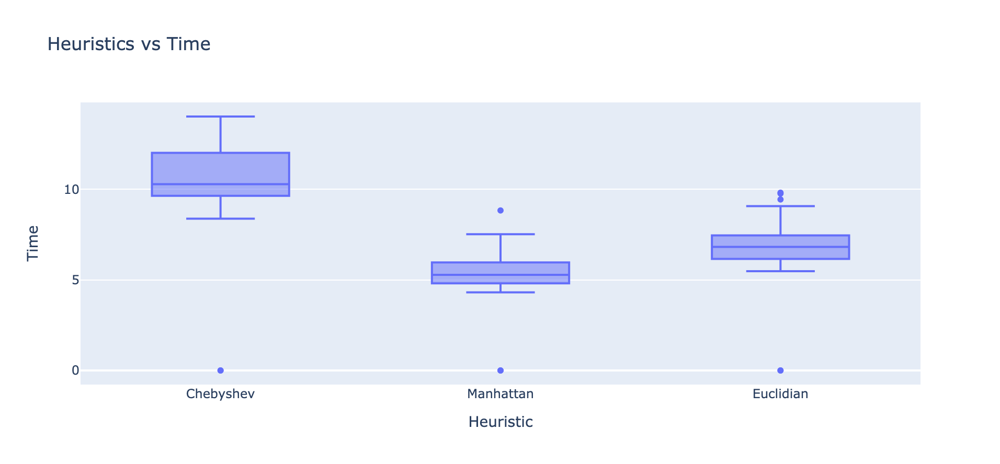

As you can see the Manhattan distance had the lowest run time out of all the other heuristics. To make sure that this data is supported we re-ran our loop with $p=0.4$ this time which was the threshold for solvability as we saw before. The bar plot is shown below.

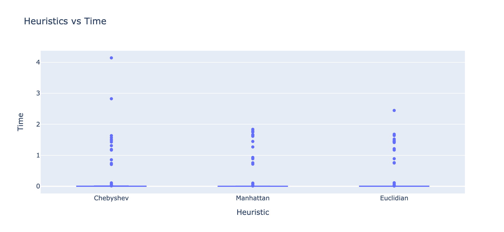

From this plot we see that our initial observation holds true even when we increase our blocking probability to $0.4$. Though there are significantly more unsolvable grids.

**Question 6**: Taking $dim = 101$, for a range of density $p$ values from 0 to min $(p_0; 0.33)$, and the heuristic chosen as best in Q5, repeatedly generate gridworlds and solve them using Repeated Forward A*. Use as the field of view each immediately adjacent cell in the compass directions. Discuss your results. Are they as you expected? Explain.

**Answer**: To calculate density vs average trajectory length, we first split our tests into 100 trials. In each trial we we ran the repeated A* algorithm 12 times between $p=0$ and $p=0.33$ at intervals of $0.03$ to see how the trajectory would increase when density is increased. Then we took the average of the hundred trials for each p-value ending up with 12 total data points for trajectory.

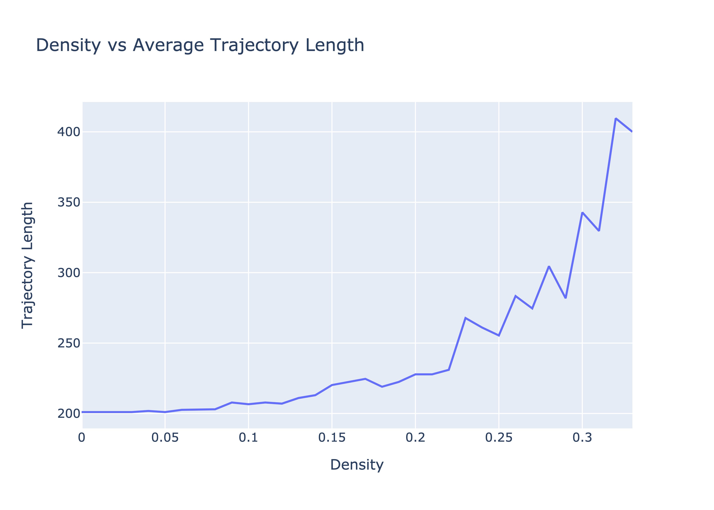

As you can see we achieved the expected result which is the positive correlation between density and average trajectory length. Obviously our algorithm had to take more steps when there are more blockages in its path. This is because our agent will encounter more blocks, forcing it to replan and move around, or possibly backtrack.

For the next graph we followed the same experiment procedure but in addition to calculating trajectory we also calculated the length of the shortest path in the discovered gridworld by running A* on the discovered grid after running repeated A*. Then after taking the average we divided the averages of the trajectories by the averages of the shortest path.

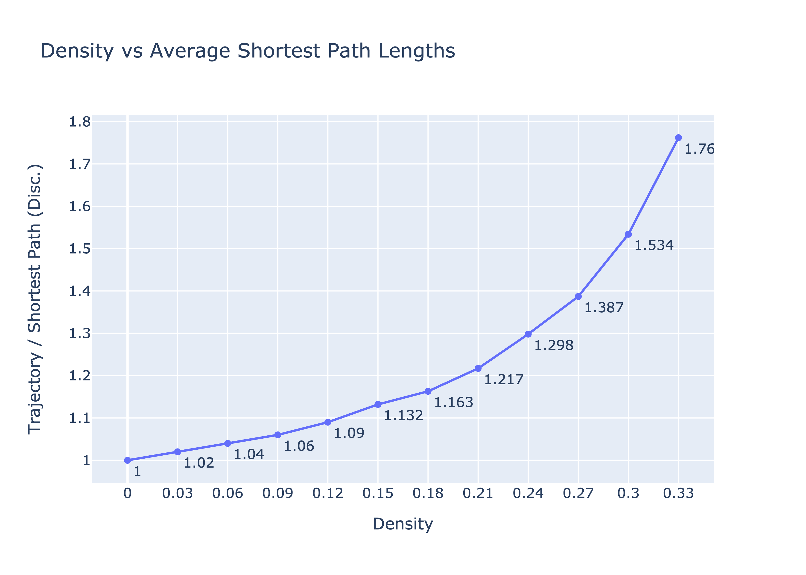

As you can see, initially while density was $p=0$ the trajectory (number of total steps taken by repeated A*) and the shortest path is the same. However as the density of obstacles increases, repeated A* will have to backtrack way more times which means that the fraction will increase as the numerator (trajectory) increases quicker than the denominator (shortest path on discovered gridworld); this is because the shortest path on the discovered gridworld will never backtrack as we run A* on the already discovered gridworld which will return the most optimal path.

Next, we look at running the shortest path on the discovered gridworld divided by the shortest path on the complete gridworld. One can expect that similar to the previous part, running shortest path on the complete grid will be much more efficient than the discovered as repeated A* might not have discovered a more efficient path initially due to blockers.

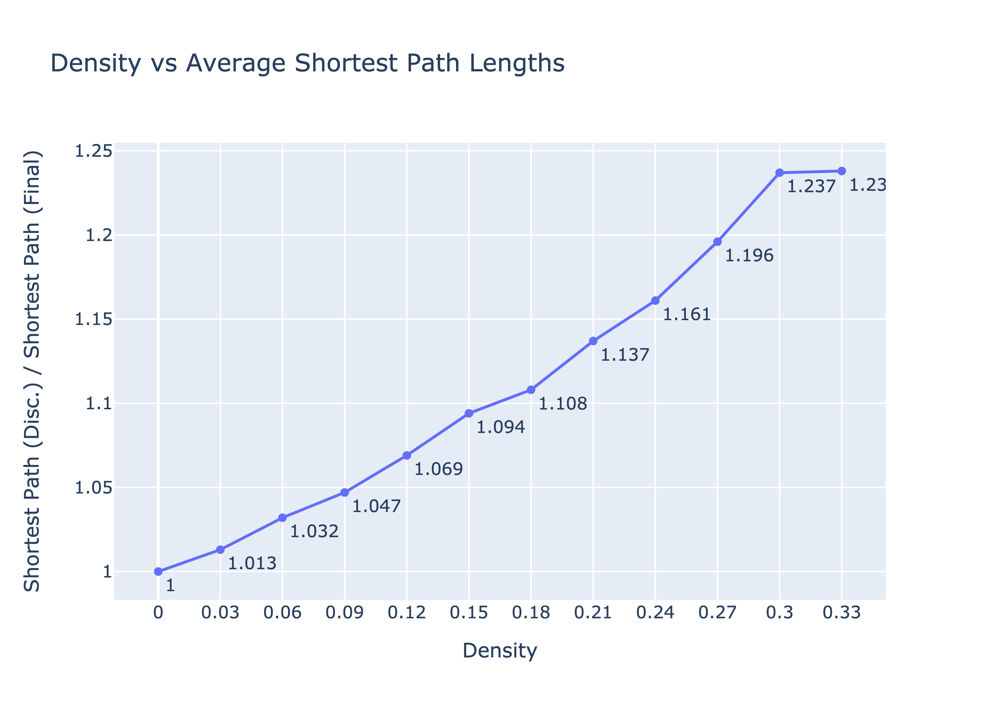

We see that this is true, however unlike the last part, our new graph increases linearly and plateaus at the end when density is $p=0.33$. This most likely means that at a certain density, the discovered grid will start to act like the complete grid as more of it will be discovered by the agent due to the increased blockages in its path. To see if this is true let's turn to our last graph.

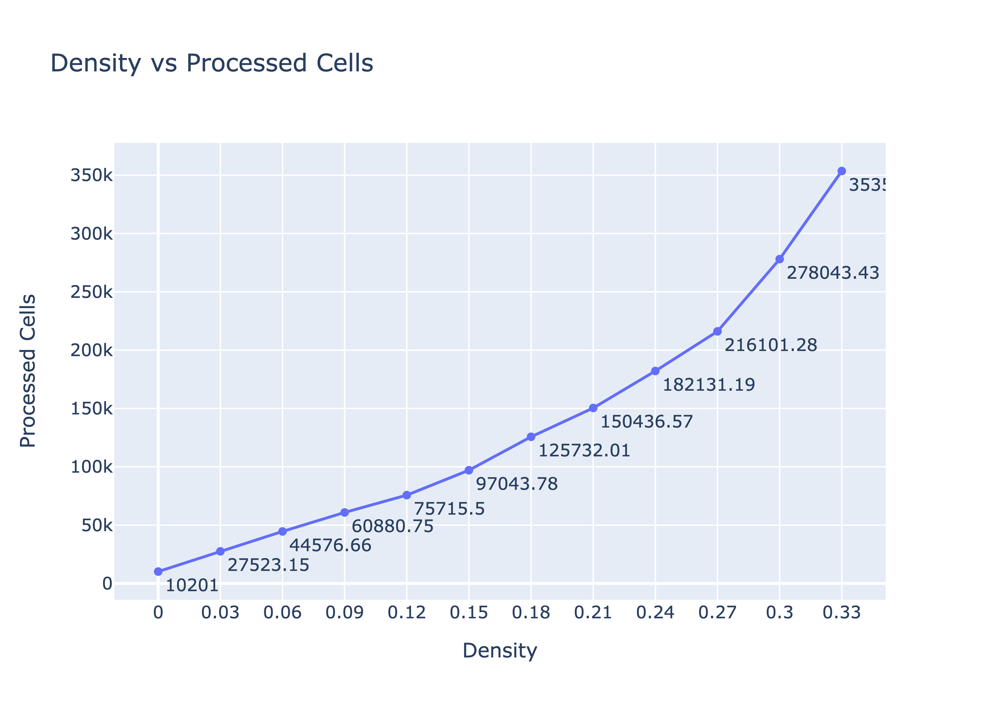

And again our hypothesis is proven true as there is a clear exponential increase in the number of cells that are processed(discovered) once density is increased. This is because each time there is a block, our agent looks at every neighbor and replans with A* which processes more cells.

**Question 7**: Generate and analyze the same data as in Q6, except using only the cell in the direction of attempted motion as the  eld of view. In other words, the agent may attempt to move in a given direction, and only discovers obstacles by bumping into them. How does the reduced field of view impact the performance of the algorithm?

**Answer**: Because less of the gridworld is updated on each move of the agent, you would think that trajectory length might be a bit longer in the reduced field of view as you might need to back track more.

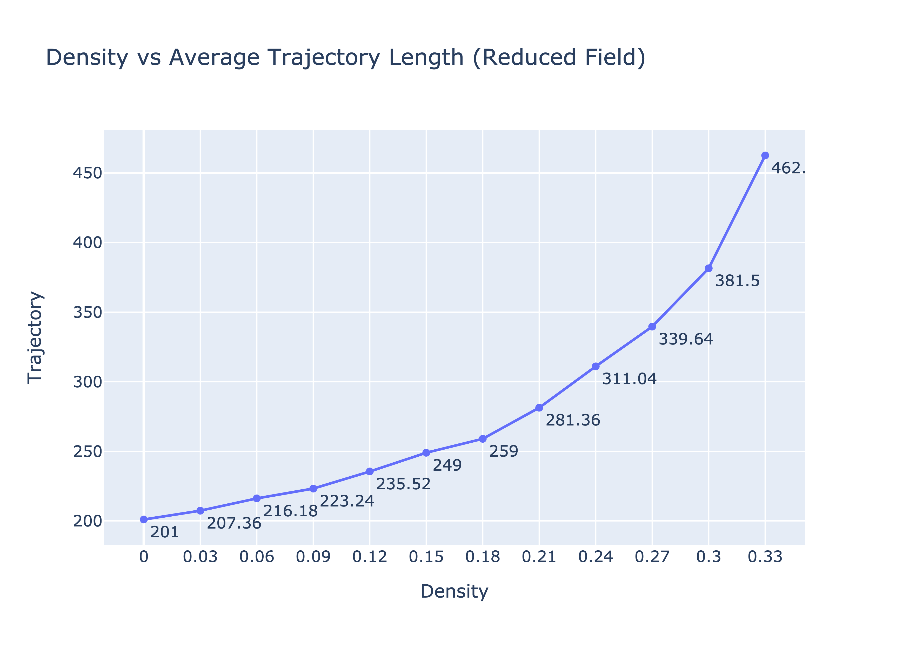

While this might be true to an extent at higher densities of blockers, we really did not see that much of an increase in the trajectory length overall in our A* implementation. This might mean that while doing repeated A* it really doesn't make much of a difference in the end overall trajectory to update neighbors while traversing the gridworld. However it takes a longer amount of time to execute the algorithm and find the trajectory.

Next we looked at the average length of the trajectory divided by the average length of the shortest path on the discovered grid. Because trajectories did not increase as much you would expect the shortest path to not have been too impacted as well as both rely on the density in a similar way.

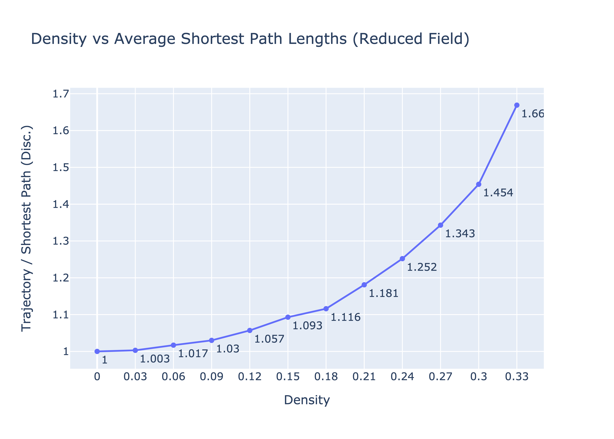

We can again see that the ratio really did not change as much again. However at higher densities the ratio in the reduced field is a tenth less than it's corresponding ratio where the agent had full field of vision. Which means that the shortest path increased in higher densities. This is because we have less of the gridworld discovered when we run A*, therefore we are less likely to find an optimal path on the gridworld which leads to an increased distance in the shortest path

Our previous conclusion directly impacts our next hypothesis. If the shortest path on the discovered grid world increased this means that our ratio between discovered and complete shortest paths increases. This is because the shortest path on the final grid will likely stay the same.

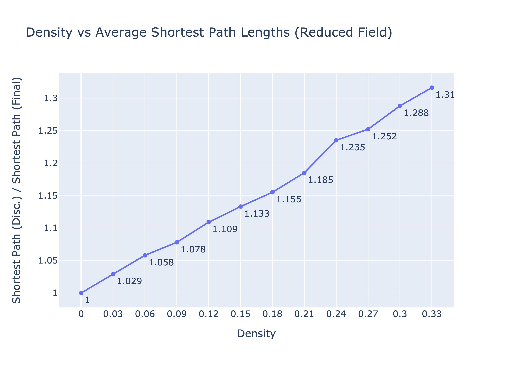

We can see from our plot that our hypothesis is supported. Even at higher densities the ratio keeps rising unlike our full field of vision as the shortest path in the reduced field of vision continues to rise.

Finally if we explore less while we're moving through the path we're surely going to have to process more cells as the only way to discover obstacles is to now encounter them and to add them to the fringe.

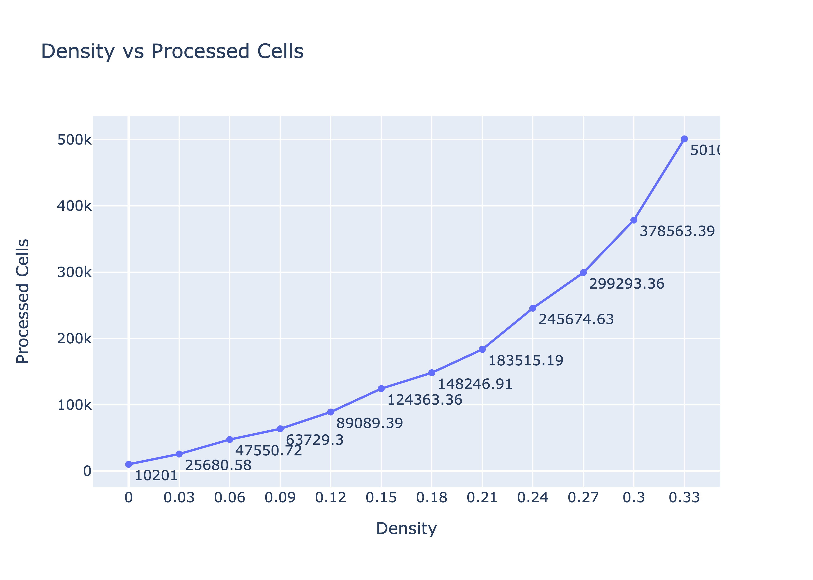

Here we can clearly see that the number of nodes required to be processed is significantly greater if we don't explore neighbors at each step in the path. This is because the agent would now likely bump into more nodes to figure out what the landscape looks like.

**Question 9**: A* can frequently be sped up by the use of inadmissible heuristics - for instance weighted heuristics or combinations of heuristics. These can cut down on runtime potentially at the cost of path length. Can this be applied here? What is the efect of weighted heuristics on runtime and overall trajectory? Try to reduce the runtime as much as possible without too much cost to trajectory length.

**Answer**:

In this problem, we can use combinations of our three admissable heuristics and weighted versions of these to create an inadmissable heuristic to improve the runtime of our repeated A* algorithm at the cost of a higher trajectory length. This is because using combinations and weighted versions of these heuristics can exaggerate the differences in priority for our fringe nodes, forcing A* to check less nodes and go for a path to the goal node at a faster runtime. For example, our f(x) value when using manhattan is equal to the node's parent's g(x) value + 1 + the manhattan distance from the node to the goal node. Because of the way the math works out and how the fringe prioritizes tied nodes, we end up examining every node when we first perform A* on the newly made blank discovered grid. However, when using a weighted heuristic such as the manhattan distance * 3, we exagerate the differences in f(x) values between the nodes, which ends up with less ties and forces our A* to immediately try to find the goal node without needing to examine the other nodes/paths. Although we improve the runtime by not examining other nodes with these weighted heuristics, this means we may not find the most optimal path to the goal node, which should increase our trajectory.

To test these weighted heuristics, we decided to try 4 different weighted/combination heuristics. The first heuristic takes the manhattan distance and multiplies it by 3. The second heuristic adds chebyshev distance and manhattan distance. The third heuristic adds chebyshev distance and euclidian distance. The last heuristic adds manhattan distance and euclidian distance.

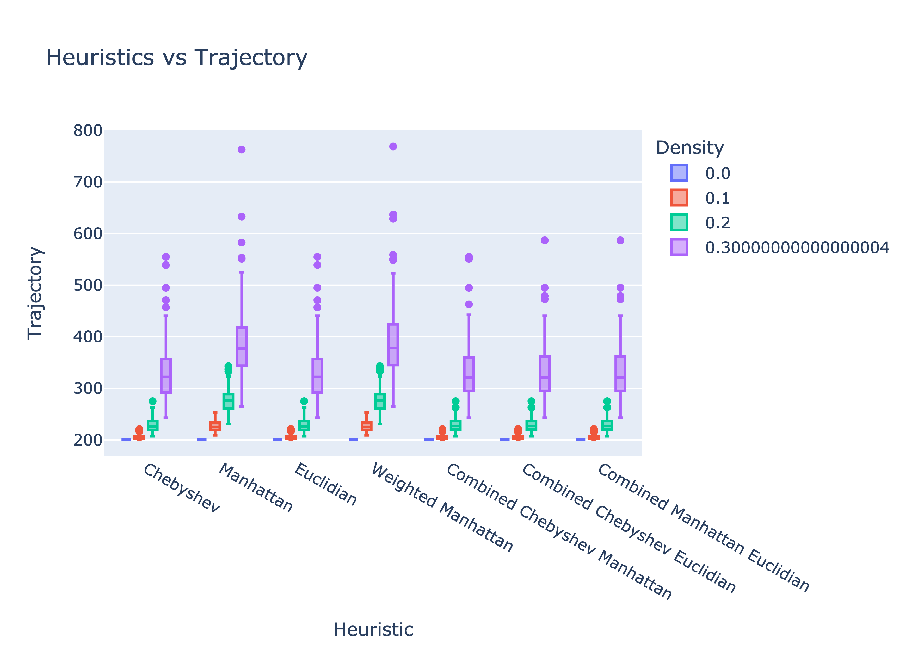

As shown in the graphs, we notice that the weighted manhattan heuristic has a slightly higher trajectory than the regular manhattan trajectory. We also notice that the combinations of heuristics tend to also have a slightly higher trajectory than the trajectories of the regular chebyshev and euclidian heuristics. This trend seems to occur across the densities, but it's more noticeable in higher densities. This matches our expectations as our weighted and combination heuristics prioritizes finding the goal node as fast as possible over finding the most optimal path as the exaggerated differences in the priorities forces A* to ignore some options. Thus, we increase our trajectory by doing this.

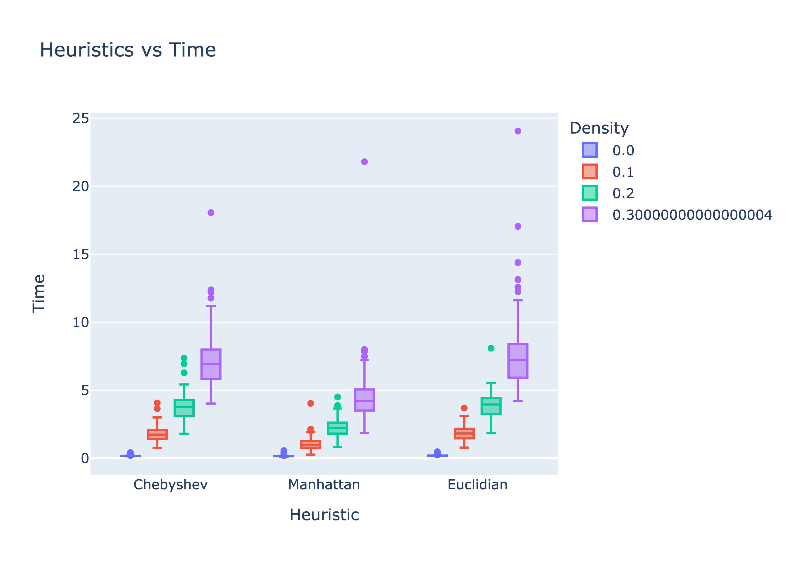

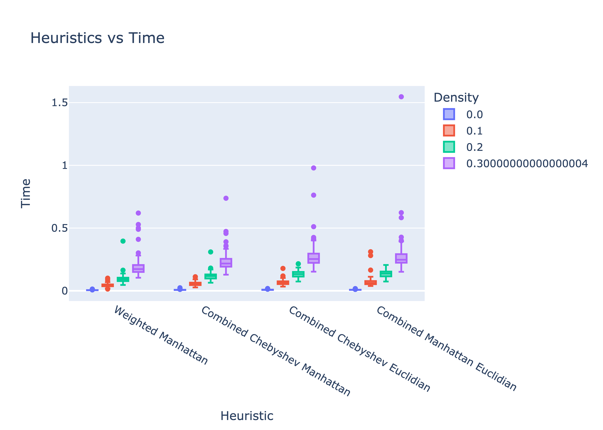

As expected, the runtime of the inadmissable heuristics is significantly better than the runtime of the regular heuristics (note the scale of both graphs). As mentioned earlier, this is expected because we are now trying to get to the goal node as fast as possible by examining fewer nodes with these weighted heuristics. By examining fewer nodes with each A* we perform during the planning phase, we cut down on the runtime.


## Appendix

**These were the functions we used to execute the A* algorithm**
**We used Python's heapq in part of our implementation for the priority queue.**

```python
# solves gridworld using A* algorithm
from priority_queue import Priority_Queue
from fringe_node import Fringe_Node

# returns the path found as a list of fringe nodes
def path_planner(start, latest_block, grid, dim, heuristic):
    # contains nodes to be discovered
    fringe = Priority_Queue()

    # contains nodes that were visited
    closed = {}

    # total number of nodes popped from fringe for processing
    cells_processed = 0

    # create the first fringe node
    start_node = Fringe_Node((start[0], start[1]), latest_block, heuristic((0, 0), (dim-1, dim-1)), 0)
    fringe.enqueue(start_node)

    # loop through the unvisited nodes
    while len(fringe.queue) > 0:
        # Dequeue from our priority queue
        curr = fringe.de_queue()
        # Add to closed set
        closed[curr.curr_block] = curr
        cells_processed += 1

        # Check if the goal node was popped
        if curr.curr_block == (dim-1, dim-1):
            # print("Path Found, Processed %s cells" % cells_processed)
            path = []
            # we reached the end, trace the path back to start
            x = curr
            while x.curr_block != start:
                path.append(x)
                x = x.parent_block
            path.append(x)
            path.reverse()
            return (path, cells_processed)
        else:
            check_neighbors(grid, dim, heuristic, curr, fringe, closed)

    print("No Path Found")
    return ([], cells_processed)
        
            
def check_neighbors(grid, dim, heuristic, curr_node, fringe, closed):
    curr_coord = curr_node.curr_block
    # check the neighbor above the block
    if curr_coord[0] - 1 >= 0:
        if grid.gridworld[curr_coord[0] - 1][curr_coord[1]] != 1 and not (curr_coord[0] - 1, curr_coord[1]) in closed:
            new_node = Fringe_Node((curr_coord[0] - 1, curr_coord[1]), curr_node, curr_node.dist_from_start + 1 + heuristic((curr_coord[0] - 1, curr_coord[1]), (dim-1, dim-1)), curr_node.dist_from_start + 1)
            fringe.enqueue(new_node)
    # check the neighbor below the block
    if curr_coord[0] + 1 < dim:
        if grid.gridworld[curr_coord[0] + 1][curr_coord[1]] != 1 and not (curr_coord[0] + 1, curr_coord[1]) in closed:
            new_node = Fringe_Node((curr_coord[0] + 1, curr_coord[1]), curr_node, curr_node.dist_from_start + 1 + heuristic((curr_coord[0] + 1, curr_coord[1]), (dim-1, dim-1)), curr_node.dist_from_start + 1)
            fringe.enqueue(new_node)
    # check the neighbor left of the block
    if curr_coord[1] - 1 >= 0:
        if grid.gridworld[curr_coord[0]][curr_coord[1] - 1] != 1 and not (curr_coord[0], curr_coord[1] - 1) in closed:
            new_node = Fringe_Node((curr_coord[0], curr_coord[1] - 1), curr_node, curr_node.dist_from_start + 1 + heuristic((curr_coord[0], curr_coord[1] - 1), (dim-1, dim-1)), curr_node.dist_from_start + 1)
            fringe.enqueue(new_node)
    # check the neighbor right of the block
    if curr_coord[1] + 1 < dim:
        if grid.gridworld[curr_coord[0]][curr_coord[1] + 1] != 1 and not (curr_coord[0], curr_coord[1] + 1) in closed:
            new_node = Fringe_Node((curr_coord[0], curr_coord[1] + 1), curr_node, curr_node.dist_from_start + 1 + heuristic((curr_coord[0], curr_coord[1] + 1), (dim-1, dim-1)), curr_node.dist_from_start + 1)
            fringe.enqueue(new_node)
```

**This was the function we used to run repeated A* code**

```python
def repeated_solver(dim, prob, heuristic, complete_grid = None):

    # create a gridworld if we don't get a grid as an argument
    if not complete_grid:
        complete_grid = Gridworld(dim, prob, False)
        complete_grid.print()

    # create gridworld that agent uses to take note of blocks
    discovered_grid = Gridworld(dim)

    # total number of cells processed
    total_cells_processed = 0

    final_path = None

    # figure out what heuristic to use
    if heuristic == "chebyshev":
        heuristic_pointer = chebyshev
    elif heuristic == "manhattan":
        heuristic_pointer = manhattan
    elif heuristic == "combined":
        heuristic_pointer = combined
    else:
        heuristic_pointer = euclidian

    starting_time = time()

    # start planning a path from the starting block
    new_path, cells_processed = path_planner((0,0), final_path, discovered_grid, dim, heuristic_pointer)
    total_cells_processed += cells_processed

    # while A* finds a new path
    while len(new_path) > 0:
        # execute the path
        last_node = execute_path(new_path, complete_grid, discovered_grid, dim)
        final_path = last_node
        # get the last unblocked block
        last_block = (0,0)
        last_unblock_node = None
        if last_node:
            last_block = last_node.curr_block
            last_unblock_node = last_node.parent_block
        # check if the path made it to the goal node
        if last_block == (dim-1, dim-1):
            break
        # create a new path from the last unblocked node
        new_path, cells_processed = path_planner(last_block, last_unblock_node, discovered_grid, dim, heuristic_pointer)
        total_cells_processed += cells_processed

    # trajectory of the final path
    trajectory_length = get_trajectory(final_path)

    return trajectory_length
```

**This method moves the agent according to our path**

```python
def execute_path(path, complete_grid, discovered_grid, dim):
    for index, node in enumerate(path):
        curr = node.curr_block
        # check if path is blocked
        if complete_grid.gridworld[curr[0]][curr[1]] == 1:
            # update our knowledge of blocked nodes
            discovered_grid.update_grid_obstacle(curr, 1)
            return node.parent_block
        discovered_grid.update_grid_obstacle(curr, 0)
        # update knowledge of neighbor blocks
        update_neighbor_obstacles(curr, discovered_grid, complete_grid, dim)
    return path[-1]
```

**This method updates the obstacles at each move**

```python
def update_neighbor_obstacles(curr, discovered_grid, complete_grid, dim):
    # check the neighbor above the block
    if curr[0] - 1 >= 0:
        if complete_grid.gridworld[curr[0] - 1][curr[1]] == 1:
            discovered_grid.update_grid_obstacle((curr[0] - 1, curr[1]), 1)
        else:
            discovered_grid.update_grid_obstacle((curr[0] - 1, curr[1]), 0)
    # check the neighbor below the block
    if curr[0] + 1 < dim:
        if complete_grid.gridworld[curr[0] + 1][curr[1]] == 1:
            discovered_grid.update_grid_obstacle((curr[0] + 1, curr[1]), 1)
        else:
            discovered_grid.update_grid_obstacle((curr[0] + 1, curr[1]), 0)
    # check the neighbor left of the block
    if curr[1] - 1 >= 0:
        if complete_grid.gridworld[curr[0]][curr[1] - 1] == 1:
            discovered_grid.update_grid_obstacle((curr[0], curr[1] - 1), 1)
        else:
            discovered_grid.update_grid_obstacle((curr[0], curr[1] - 1), 0)
    # check the neighbor right of the block
    if curr[1] + 1 < dim:
        if complete_grid.gridworld[curr[0]][curr[1] + 1] == 1:
            discovered_grid.update_grid_obstacle((curr[0], curr[1] + 1), 1)
        else:
            discovered_grid.update_grid_obstacle((curr[0], curr[1] + 1), 0)
```