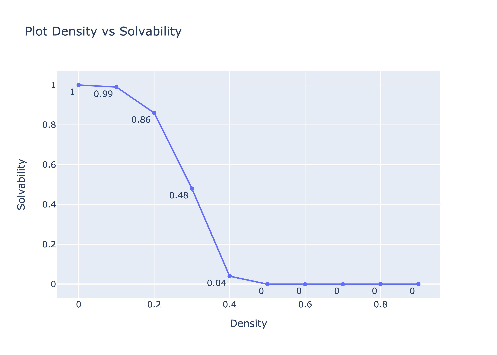
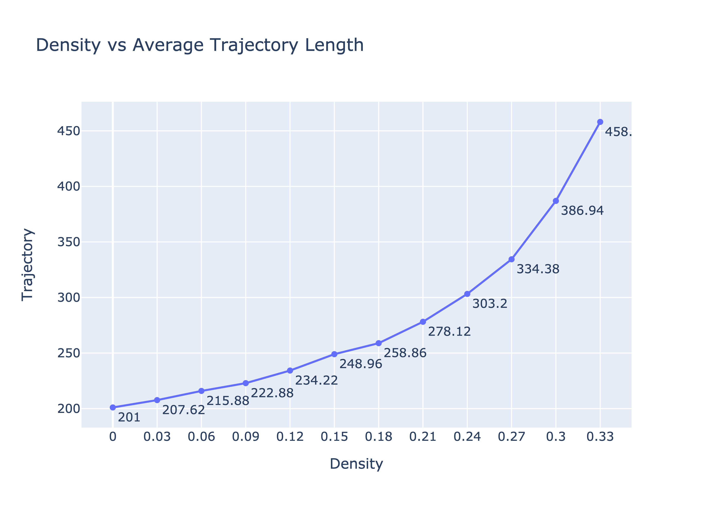

# Voyage Into the Unknown
### Advith Chegu & Naveenan Yogeswaran

**Question 1**: Why does re-planning only occur when blocks are discovered on the current path? Why not whenever knowledge of the environment is updated?

**Answer**: Because A* finds the optimal path, it shouldn't matter if there are any obstacles that are not in the path as we will continue on our current path. It would be a waste of time to re-plan every time there's an update in the environment as planning takes at best $O(n)$ each time and if there are at most $n$ blocked nodes, we can see that this situation would quickly rise to exponential time. 

**Question 2**: Will the agent ever get stuck in a solvable maze? Why or why not?

**Answer**: Because we use the A* algorithm, we will never get stuck in a solvable maze. This is because A* will explore every node that’s reachable until there are no more nodes to explore, in which case the maze has to be unsolvable. The agent *does* get stuck in a maze when its neighbors are arranged in a way that it is blocked from progressing even if it back tracks *(an unsolvable maze)*. Let's take an example of one:

```
[0, 0, 1, 1, 1, 1, 1, 1, 1, 1]
[1, 1, 1, 1, 1, 1, 1, 1, 1, 0]
[0, 0, 0, 0, 0, 1, 1, 0, 1, 1]
[1, 1, 0, 0, 0, 1, 1, 1, 0, 0]
[1, 0, 1, 1, 1, 1, 0, 1, 1, 1]
[1, 1, 0, 1, 1, 0, 0, 0, 1, 0]
[1, 1, 1, 0, 0, 1, 1, 0, 1, 1]
[1, 1, 0, 1, 1, 0, 1, 1, 1, 0]
[0, 1, 0, 1, 1, 0, 1, 1, 1, 1]
[1, 0, 1, 0, 1, 1, 0, 1, 1, 0]
```

We clearly see that the above maze is not solvable because once the agent takes a step to the right, there is no additional step to take other than back to the start and once it back tracks there is no way to move forward. Now lets see an example of a solvable maze:

```
[0, 1, 0, 0, 0, 0, 0, 0, 0, 1]
[0, 0, 0, 0, 0, 0, 0, 0, 1, 0]
[0, 0, 1, 0, 0, 1, 1, 0, 0, 1]
[1, 0, 1, 0, 0, 0, 0, 0, 0, 1]
[0, 0, 0, 0, 0, 0, 0, 0, 0, 0]
[0, 0, 0, 0, 0, 0, 0, 0, 0, 0]
[0, 0, 0, 0, 0, 0, 1, 0, 0, 0]
[1, 0, 0, 0, 0, 0, 0, 0, 0, 0]
[1, 0, 0, 0, 0, 0, 0, 0, 1, 0]
[0, 0, 0, 0, 0, 1, 0, 0, 0, 0]
```

Once we run repeated A* we find the following path:

```
[2, 1, 0, 0, 0, 0, 0, 0, 0, 1]
[2, 2, 0, 0, 0, 0, 0, 0, 1, 0]
[0, 2, 1, 0, 0, 1, 1, 0, 0, 1]
[1, 2, 1, 0, 0, 0, 0, 0, 0, 1]
[0, 2, 2, 2, 2, 0, 0, 0, 0, 0]
[0, 0, 0, 0, 2, 2, 0, 0, 0, 0]
[0, 0, 0, 0, 0, 2, 1, 0, 0, 0]
[1, 0, 0, 0, 0, 2, 2, 2, 0, 0]
[1, 0, 0, 0, 0, 0, 0, 2, 1, 0]
[0, 0, 0, 0, 0, 1, 0, 2, 2, 2]
```

Now although the agent had to recalculate **4** times due to obstacles in its original path, our agent is always going to move backwards and find a different path each time. We do this by first checking if the current path is blocked and returning the section before the blocked node.

```python
if complete_grid.gridworld[curr[0]][curr[1]] == 1:
    # update our knowledge of blocked nodes
    discovered_grid.update_grid_obstacle(curr)
    # remove the path starting with the blocked node
    path = path[:index]
    return path
```

Then we go back and create a new path (avoiding the visited neighbor nodes) using repeated A*.

```python
last_node = new_path.pop()
last_unblock = last_node.curr_block
# append the rest to the final path
final_path.extend(new_path)
# check if the path made it to the goal node
if last_unblock == (dim-1, dim-1):
    final_path.append(last_node)
    break
# create a new path from the last unblocked node
new_path = path_planner(last_unblock, discovered_grid, dim, euclidian)
```

By using this smart method of backtracking in the case of a blockage in the path, we can avoid getting stuck in a solvable maze as we can always move back node by node to check if there are any unvisited paths that were missed in the first go around.

**Question 3**: *Unsure* Once the agent reaches the target, consider re-solving the now discovered gridworld for the shortest path (eliminating any backtracking that may have occurred). Will this be an optimal path in the complete gridworld? Argue for, or give a counter example.

**Counter Questions**: Is the path the agent takes after it has already solved the gridworld the same as the initial path when it does solve it?

Does repeated A* return the most optimal path?

**Answer**: The A* algorithm will always give us the shortest path depending on our heuristic. This means that if we were to re-solve the discovered gridworld after finding a path, the new path is guaranteed to be the shortest due to the way our heuristic/priority is measured. To back up my argument, let me explain how new nodes are added to the priority queue:

```python
curr_coord = curr_node.curr_block
# check the neighbor above the block
if curr_coord[0] - 1 >= 0:
    if grid.gridworld[curr_coord[0] - 1][curr_coord[1]] == 0 and not (curr_coord[0] - 1, curr_coord[1]) in closed:
        new_node = Fringe_Node((curr_coord[0] - 1, curr_coord[1]), curr_coord, curr_node.dist_from_start + 1 + heuristic((curr_coord[0] - 1, curr_coord[1]), (dim-1, dim-1)), curr_node.dist_from_start + 1)
        fringe.enqueue(new_node)
# Same thing is done to the other neighbors of the node
```

As you can see the priority queue is ordered by the nodes which are closer to the finish point w.r.t. the heuristic. Therefore even if one of the neighbors is blocked, the agent will move in the direction closest to the finish point when chosing a different node to move to.

**Question 4**: A gridworld is solvable if it has a clear path from start to goal nodes. How does solvability depend on $p$? Given $dim = 101$, how does solvability depend on $p$? For a range of $p$ values, estimate the probability that a maze will be solvable by generating multiple environments and checking them for solvability. Plot density vs solvability, and try to identify as accurately as you can the threshold $p_0$ where for $p < p_0$, most mazes are solvable, but $p > p_0$, most mazes are not solvable. Is A* the best search algorithm to use here, to test for solvability? Note for this problem you may assume that the entire gridworld is known, and hence only needs to be searched once each.

**Answer**: We can assume that once density of blocks increases, there will be a steep decline in solvability and the number of paths to the finish node will be severely reduced. To test our hypothesis we calculated solvability after running 20 trials of the algorithm at p being each tenth of a decimal between 0.1 to 0.9. After running our test, we got this resulting plot.



As we can see, there's a clear and steep decline of the solvability of the gridworld once we increase $p_0$ to $0.4$. Therefore our hypothesis has been tested and true; solvability does indeed fall steeply once you reach a threshold probability of $0.4$ when solvability decreases to $0.05$ according to our testing.

We do believe that A* is the best search algorithm as it is guaranteed to find a path in any solvable gridworld due to it's backtracking, path planning, and heuristics methodologies. Therefore if A* did not succeed it means that the gridworld was not a solvable one which is what we are trying to measure.

**Question 5**: Among environments that are solvable, is one heuristic uniformly better than the other for running A*? How can they be compared? Plot the relevant data and justify your conclusions. Again, you may take each gridworld as known, and thus only search once.

**Answer**: Acording to our findings the manhattan distance is uniformly better than the others for running A*. To find the best heuristic we first fixed $p=0.1$ and $dimension=500$ and we ran the following loop 100 times recording the time each loop and each heuristic. To be fair to all three heuristics we made sure to use the same grid for each one every time we ran the loop.

```python
# create the gridworld
    complete_grid = Gridworld(dim, prob, False)
    final_path = None

    # times: chebyshev, manhattan, euclidian
    times = []

    for i,h in enumerate([chebyshev, manhattan, euclidian]):
        starting_time = time()
        path_planner((0,0), final_path, complete_grid, dim, h)
        times.append(time() - starting_time)
    
    print(times)
```

Then we saved all of the times and graphed the data using a bar plot.


As you can see the Manhattan distance had the lowest run time out of all the other heuristics. To make sure that this data is supported we re-ran our loop with $p=0.4$ this time which was the threshold for solvability as we saw before. The bar plot is shown below.


From this plot we see that our initial observation holds true even when we increase our blocking probability to $0.4$. Though there are significantly more unsolvable grids.

**Question 6**: Taking $dim = 101$, for a range of density $p$ values from 0 to min $(p_0; 0.33)$, and the heuristic chosen as best in Q5, repeatedly generate gridworlds and solve them using Repeated Forward A*. Use as the field of view each immediately adjacent cell in the compass directions. Discuss your results. Are they as you expected? Explain.

**Answer**: To calculate density average trajectory length first split our tests into five trials. In each trial we we ran the repeated A* algorithm 34 times between $p=0$ and $p=0.33$ to see how the trajectory would increase when density is increased. Then we took the average of the five trials for each p-value.



As you can see we achieved the expected result which is the positive correlation between density and average trajectory length. Obviously our algorithm had to take more steps when there are more blockages in its path.

